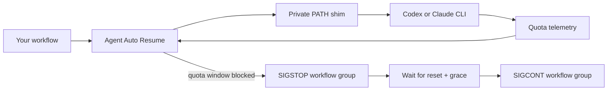

<div align="center">

# Agent Auto Resume

**Keep Codex and Claude CLI workflows moving across subscription resets.**

[](#requirements)
[](#requirements)
[](LICENSE)

Agent Auto Resume is a lightweight, dependency-free supervisor for project
workflows that call the Codex or Claude CLI.

</div>

> [!WARNING]
> This is alpha software. Usage reporting happens after provider work, so a
> large turn can cross the configured threshold before Agent Auto Resume can
> pause the workflow.

## Why use it?

| Without Agent Auto Resume | With Agent Auto Resume |
| --- | --- |
| A quota reset interrupts a long-running agent workflow. | The workflow process group pauses, waits for reset, then resumes. |
| A quota failure can leave manual session recovery to you. | It prefers the still-running process, then native session recovery where supported. |
| A supervisor crash could leave a stopped workflow behind. | A watchdog sends `SIGCONT` if the supervisor exits unexpectedly. |

### What it does

- Guards `codex` and `claude` calls made through an inherited `PATH`.
- Observes subscription usage at safe provider CLI boundaries.
- Stops and resumes the entire workflow process group, not just one child process.
- Stores owner-only runtime state and never reads or copies provider credential files.
- Has no third-party Python runtime dependencies.

## Quickstart

### 1. Check compatibility

```bash
./agent-resume doctor
```

### 2. Run your usual provider CLI through the supervisor

```bash
# Start an interactive Codex session.
./agent-resume cli codex

# Start Claude with an initial prompt.
./agent-resume cli claude "Review this repository and suggest the next task."
```

### 3. Or supervise an existing agent workflow

```bash
./agent-resume run -- ./scripts/agent-workflow.sh
./agent-resume run -- npm run agent-workflow
```

### 4. Inspect an active or completed run

```bash
./agent-resume status
```

Add `--verbose` to `run` or `cli` to print pause, resume, and monitoring
messages:

```bash
./agent-resume cli --verbose codex
```

## How it works



Agent Auto Resume creates a private run directory under
`$TMPDIR/agent-resume/<uid>/<run-id>`, then starts the workflow in its own
POSIX process group. Private `codex` and `claude` shims are prepended to the
child's `PATH`; they communicate with the supervisor over a mode-`0600` Unix
socket. No provider credential file is opened or copied.

## Install

### Run from a clone

```bash
git clone https://github.com/Allen-J0421/agent-auto-resume.git
cd agent-auto-resume
./agent-resume doctor
```

### Install the command globally

```bash
python3 -m pip install --user .
agent-resume doctor
```

## Requirements

- Python 3.9 or newer
- macOS or Linux
- An authenticated official `codex` or `claude` CLI
- A ChatGPT-backed Codex or Claude.ai subscription

API-key RPM/TPM and billing limits are intentionally out of scope.

## Commands

### `run` — supervise an existing workflow

```bash
agent-resume run [options] -- <program> [args...]
```

Use `run` for scripts, task runners, and other local programs that invoke
`codex` or `claude`. Agent Auto Resume launches the complete command in a new
process group and temporarily places guarded provider shims first on its
`PATH`.

```bash
agent-resume run -- ./your-agent-workflow
agent-resume run --provider both -- ./scripts/research-and-implement.sh
agent-resume run --threshold 95 -- npm run agent-workflow
```

Everything after `--` belongs to your workflow and is passed through unchanged.

### `cli` — run Codex or Claude directly

```bash
agent-resume cli [options] codex [args...]
agent-resume cli [options] claude [args...]
```

Use `cli` for a regular provider session. Arguments after `codex` or `claude`
are forwarded to that provider unchanged.

```bash
agent-resume cli codex
agent-resume cli --verbose codex --full-auto "Implement the requested change"
agent-resume cli claude "Explain the test failures"
agent-resume cli claude --print "Summarize this repository"
```

### `doctor` — check local compatibility

```bash
agent-resume doctor [--json]
```

Checks operating-system support, Python, provider executables, and locally
available monitoring paths. Run it first when monitoring does not behave as
expected. Use `--json` in scripts.

### `status` — inspect the latest local run

```bash
agent-resume status [--json]
```

Shows the latest run started from the current directory: state, detected
provider, child process ID, session ID, and observed quota windows. States are
`running`, `pause_pending`, `waiting`, `verifying`, `failed`, and `completed`.

### Common options

| Option | Meaning |
| --- | --- |
| `--provider auto\|codex\|claude\|both` | Providers to guard. `auto` is the default; direct `cli codex` / `cli claude` selects that provider. |
| `--threshold 0..100` | Pause when observed usage reaches this percentage. Default: `98`. |
| `--reset-grace SECONDS` | Extra time to wait after a provider's reported reset. Default: `15`. |
| `--no-session-resume` | Do not attempt native provider session recovery after a quota failure. |
| `--retry-idempotent` | Permit one retry when session recovery is unavailable. Use only for calls that are safe to repeat. |
| `--verbose` | Print pause, resume, and monitoring-degradation messages. |

Agent Auto Resume options belong before `--` in `run` mode and before the
provider name in `cli` mode.

## Provider support

| Provider | Usage signal | Strongest recovery path |
| --- | --- | --- |
| Codex | Official `app-server --stdio` rate-limit APIs; direct mode also monitors updates and polls. | Proactive pause at a terminal-input boundary, then same process-group resume. |
| Claude | Temporary status-line integration and `StopFailure` hook; structured JSONL is also observed without modification. | Native session resume after a typed quota failure with a captured session ID. |

If monitoring is unavailable, the provider invocation runs unguarded rather
than being misclassified as quota exhaustion.

## Recovery model

Agent Auto Resume selects the safest available continuation in this order:

1. Continue the still-running process after a proactive pause.
2. Continue a captured provider session after a typed quota failure.
3. Replay one intercepted invocation only with `--retry-idempotent`.
4. Exit with code `75` when no safe continuation exists.

The wrapped command's normal exit code is preserved. Agent Auto Resume never
replays the top-level workflow.

## Limitations

PATH interception cannot observe:

- Absolute provider paths such as `/usr/local/bin/claude`
- SDK or direct API calls
- Remote processes
- Subprocesses that replace `PATH`

Managed Claude policy can also reject temporary hooks or status-line settings.
`agent-resume doctor` surfaces locally detectable limitations.

## Development

```bash
python3 -m unittest discover -v
python3 -m compileall -q agent_resume
```

Tests use fake CLIs and app servers and do not consume provider quota. See
[CONTRIBUTING.md](CONTRIBUTING.md) for contribution guidance,
[SECURITY.md](SECURITY.md) for responsible vulnerability reporting, and
[RELEASING.md](RELEASING.md) for release steps.

## References

- [Codex app-server protocol](https://github.com/openai/codex/blob/main/codex-rs/app-server/README.md)
- [Claude Code status line](https://code.claude.com/docs/en/statusline)
- [Claude Code hooks](https://code.claude.com/docs/en/hooks)
- [Claude Code sessions](https://code.claude.com/docs/en/sessions)

## License

MIT — see [LICENSE](LICENSE).
